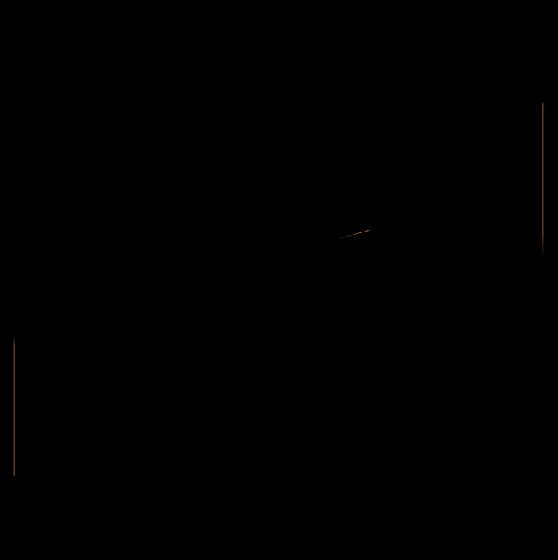
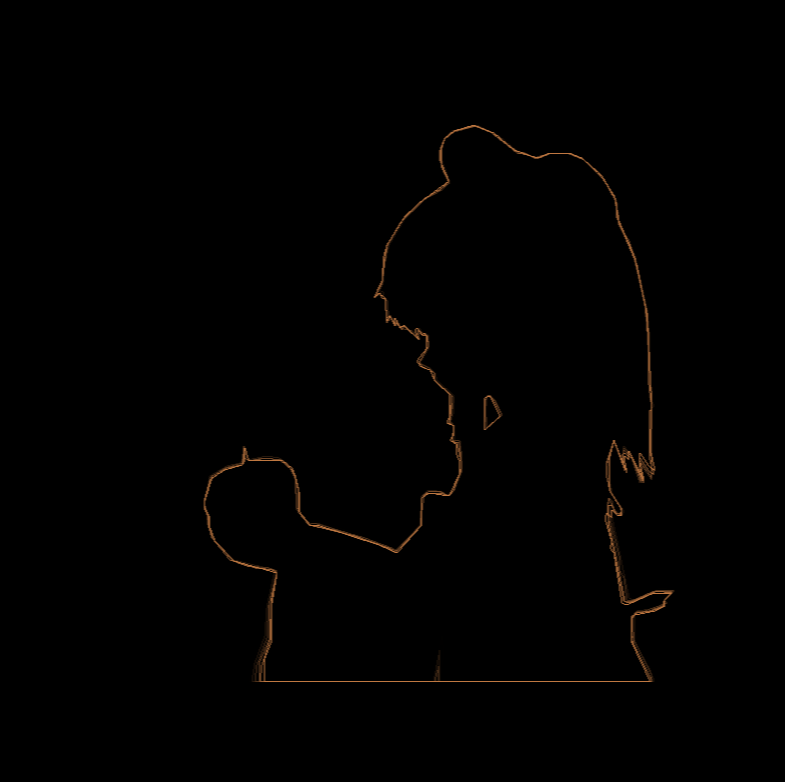

# IVM -- a toy stack-based ISA

Quick links:

 - [Cheatsheet](./docs/cheatsheet.txt)
 - [Assembler directives](./docs/asm-directives.md)
 - [Hardware description](./docs/hardware.md)
 - [Instruction list](./docs/instructions.md)
 - [Info about interrupts](./docs/interrupts.md)
 - [Changes in version 2](./docs/v2.md)

This is a ISA, with assembler for it and emulator I designed as part of a
task at first year of C course in MIPT. It was slightly redesigned when I
was writting a compiler for it a year later. At its core it is stack-based.

First version of ISA was highly inspired by Ethereum's virtual machine (in 10-th
grade I wrote my first assembler for it). Second version was somewhat inspired
by X86.

## A quick overview of what is here

 - Machine
    - 4K of io memory, 60K of RAM for the program, unlimited amout of ROM
    - Some memory-mapped IO:
        - A printer 
        - A emulated vector CRT display
    - Interrupts: timer, exception and keyboard
    - ~60 instructions
    - (v2) Second stack in RAM. First stack is now treated as registers. `sp` register for second stack.
    - (v2) Stack frames, addressing relative to them (like `[rbp-N]` in x86). `fp` register for it.

  - Assembler
    - Has compile-time expressions.
    - (v2) Supports `.include` directive

## More detailed architecture overview

Machine has a stack. Normal instructions (like `add`) push/pop from it.
Access to lower items of stack is provided by `fswap`/`pull` instructions,
which swap/get N-th item from stack.

Machine has some amount of RAM. Originaly it was just for globals,
but in version 2 we have a second stack there. Unlike first, which acts
like regsters, this one is designed like on X86 -- it grows downward,
it's top is pointed to register `sp`.

To make indexing it more sensible, machine in version 2 also has `sf` register
-- stack frame pointer. There are instructions to address stack relative
the frame pointer, which makes writting a backend way nicer.

Machine has 4K of IO memory. This memory is meant for putting memory-mapped IO
in there. Currently there are:

 - Interrupt vectors
 - Exception data for interrupt handler: exception type (segfault, divide by zero, etc), exception pc, segfault address
 - Printer: a byte written to that address will be printed in emulator's terminal
 - CRT: we have a couple of registers, with which we can move CRT beam around.

This ISA design is probbably fairly bad for real hardware (due to this 
being a stack machine, which will probbably make pipelining harder), but
the base of it was designed by me in first semester, when I knew nothing about that.

## Demo programs

Except for feature demos, there are currently two programs with > 100 loc for it.

### Pong (`examples/v1/pong.s`) ~ 960 loc



This is the original demo program, demonstrated when presenting the project.

It contains a playable game. Paddles which have velocity/acceleration, ball.
Graphically it is not that impressive, because graphical functions would have
a lot of work with 2d vectors, working with which would require manually
computing a ton of stack offsets.

If you end up running it, keys `[q]`/`[a]` are used for left paddle and `[o]`/`[l]` for left.
`[Space]` starts/restarts the game.

### Bad apple (`examples/v2/apple/player.s`) ~ 150 loc



This program was designed as a font renderer -- font glyphs are stored
as sequences of operations: `move X Y`, `line X Y`, and `end`.
Program interprets those.

In this example it runs through outlines of the "Bad apple" video.

This is a testbed for new features of version 2. Stack frame relative adressing
allowed more complex functions to be written, without that offset-from-top hell.

Version 2 was designed for writting a compiler, so I did not write a big example.

## Compiling & running samples by yourself

First semester I was fan of `meson`, so it is required to build this project.
The emulator requires `raylib` to run.

To compile you go to project's directory and do:
```sh
$ meson setup build
$ cd build
$ meson compile
```

Now you have 3 binaries:
 - `iasm` -- the assembler, used like `./iasm ASM_FILE BINARY_FILE`
 - `ivm` -- the emulator, used like `./ivm BINARY_FILE`
 - `ivm-objdump` -- simple objdump, used like `./ivm-objdump BINARY_FILE`

Using those examples can be assembled & ran:

```sh
build/ $ ./iasm ../examples/v2/pong.s pong.bin
build/ $ ./ivm pong.bin
```

